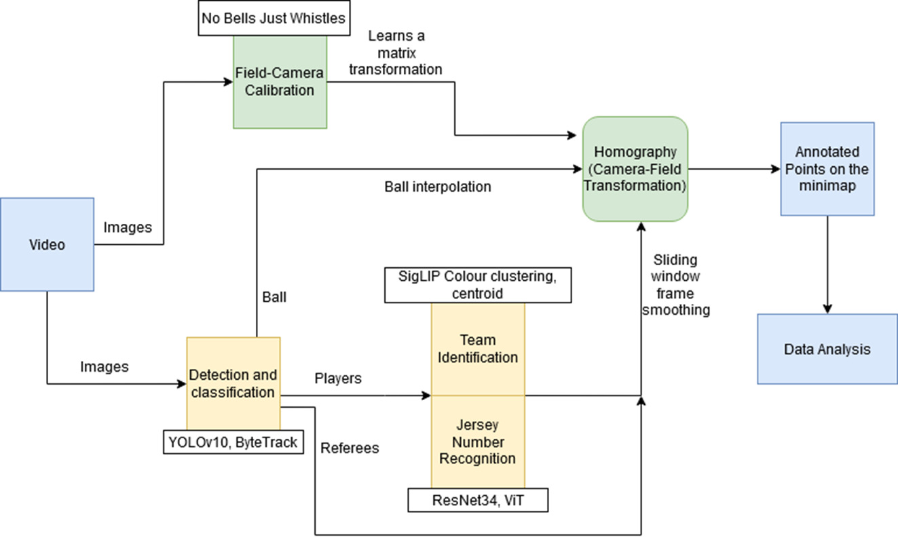
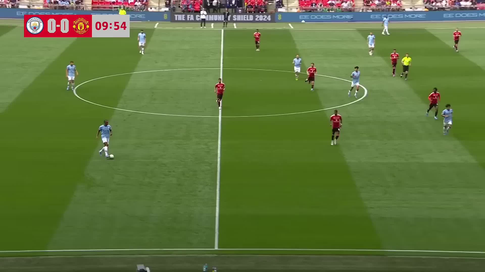
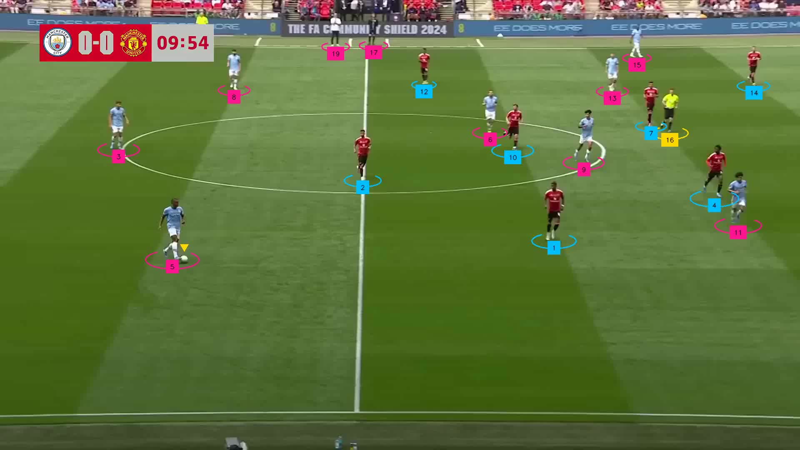
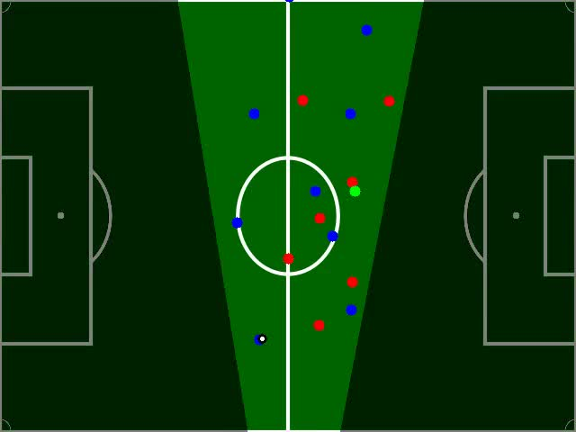

# SoccArt - Pipeline for Soccer Game Analysis

Welcome to the Soccer Analysis project! This paper presents an automated computer vision pipeline for soccer game analysis using video input. The system employs YOLOv10 and ByteTrack for robust detection and tracking of players, referees, and the ball. Team identification and jersey number recognition are achieved through SigLIP-based color clustering and neural networks like ResNet34 and ViTPose. Field-camera calibration and homography transformation map detected entities onto a minimap. Interpolation with sliding window smoothing ensures temporal consistency. The pipeline provides accurate positional data and annotations, enabling detailed gameplay analysis and insights into soccer strategies.

## Conference Presentation
This project was proudly presented as a poster at the 1st Conference on Applied AI and Scientific Machine Learning (CASML 2024) from 16th to 18th December 2024. Our innovative approach to soccer game analysis garnered significant interest and showcased the potential of advanced computer vision techniques in sports analytics.
### Poster Title
**SoccArt: Soccer Game Analysis**

**State of the Art Soccer Analysis Pipeline using Artificial Intelligence**

[View Poster](docs/CASML_Poster_Soccer_Game_Analysis.pdf)

[Read Abstract](docs/CASML_Abstract_Soccer_Game_Analysis.pdf)

[Watch Tracking Demo](https://youtu.be/RK7scSvPiHY)

### Authors
- Aditya Gupta
- Armaan Khetarpaul
- R. K. Shishir
- Sahil Chaudhary
- S. Sharath
- Umang Majumder

## Key Features
- **Accurate Player and Ball Detection**: Utilizing state-of-the-art YOLOv10 models.
- **In-depth Game Analysis**: Extract meaningful insights from video feeds.
- **Customizable Models**: Finetune your own models or use our pre-trained weights.
- **Visual Representations**: Heatmaps, minimaps, and more to visualize game dynamics.

## Getting Started
1. **Install Dependencies**: Run `pip install -r requirements.txt` to install the required packages.
2. **Download Models**: Obtain the `SV_FT_WC14_kp` and `SV_FT_WC14_lines` files from [this repository](https://github.com/mguti97/No-Bells-Just-Whistles) and place them in the `models` folder.
3. **Model Training**: If you wish to finetune your own models, follow the instructions in the `training` folder. Alternatively, use the provided weights in the `models` folder.
4. **Run Analysis**: Execute `main.py` to perform detection and analysis on the video feed.

## Results
Explore the results folder to see example videos with their detections.

## Pipeline Overview

## Demo

### Original Video

### Detection Markers

### Minimap Visualization

Unlock the full potential of football game analysis with our cutting-edge Sports Analysis project. Dive into the data and transform the way you understand the game!
